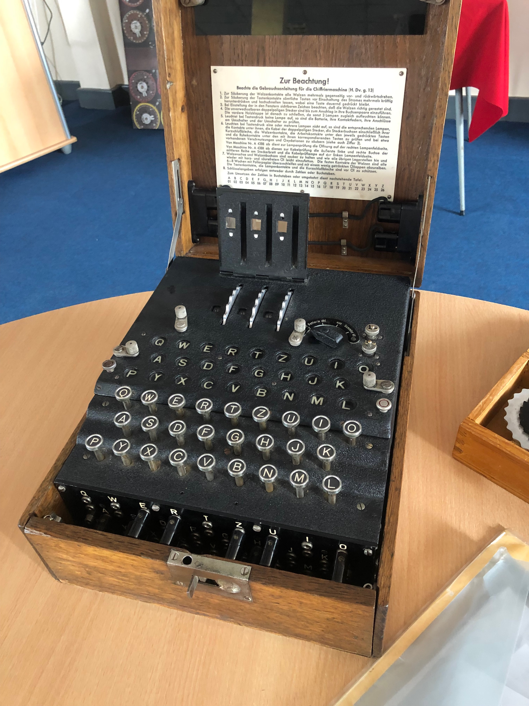
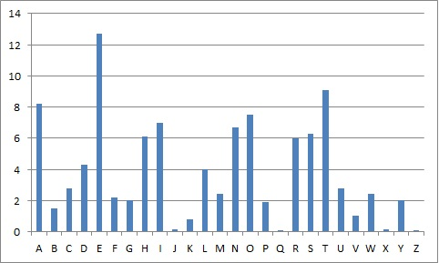
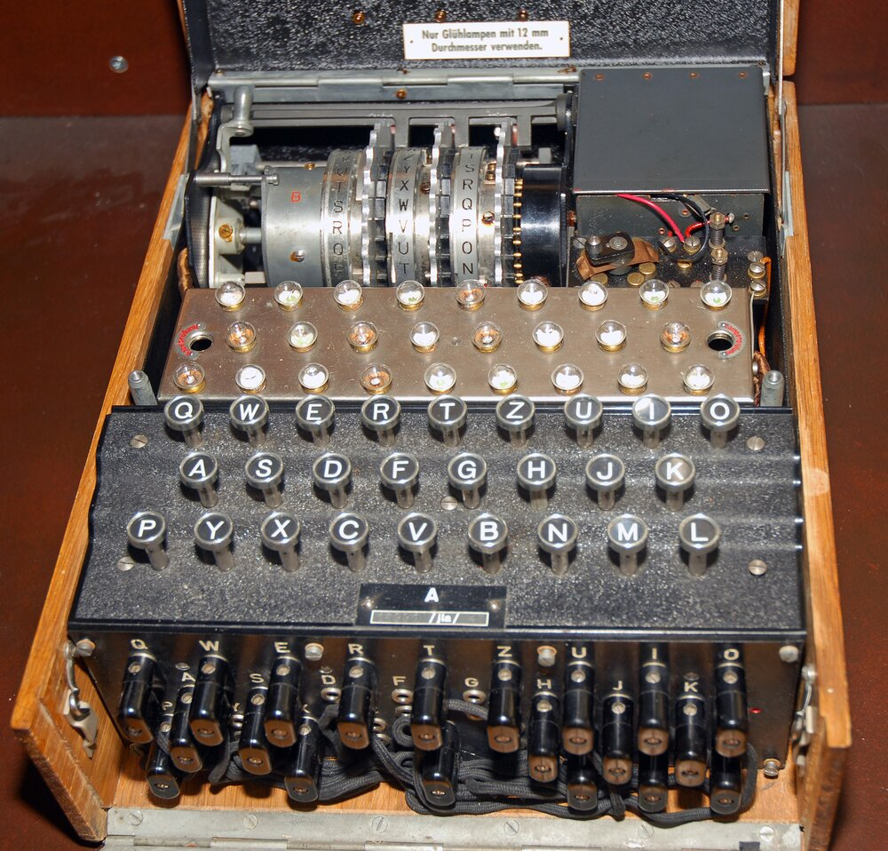
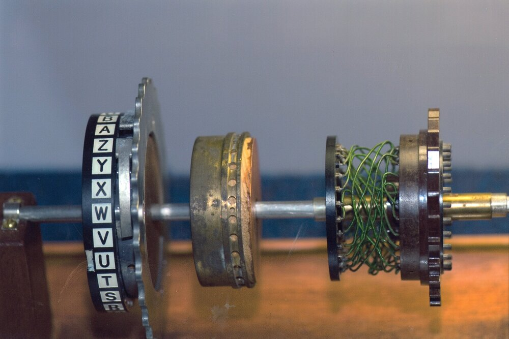
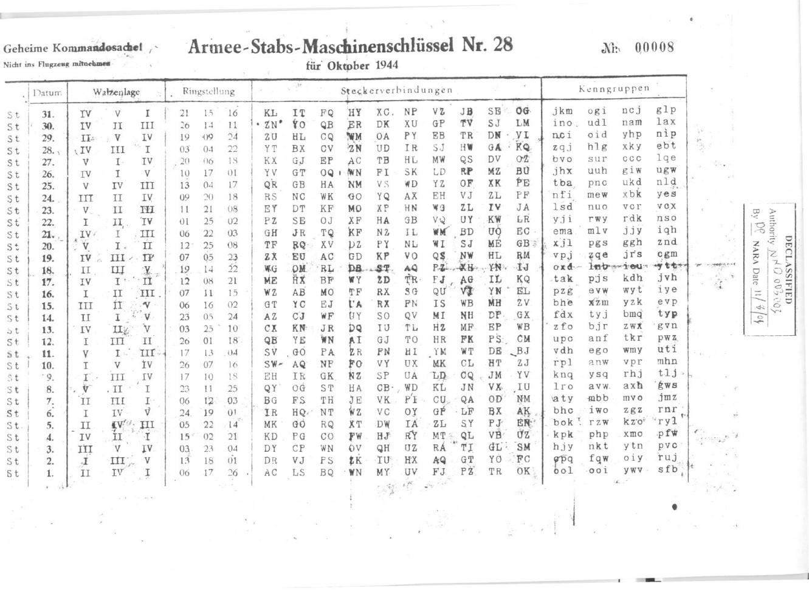
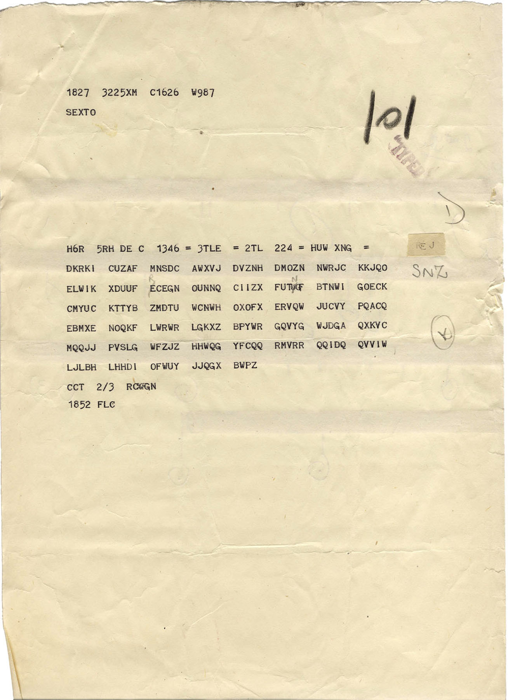
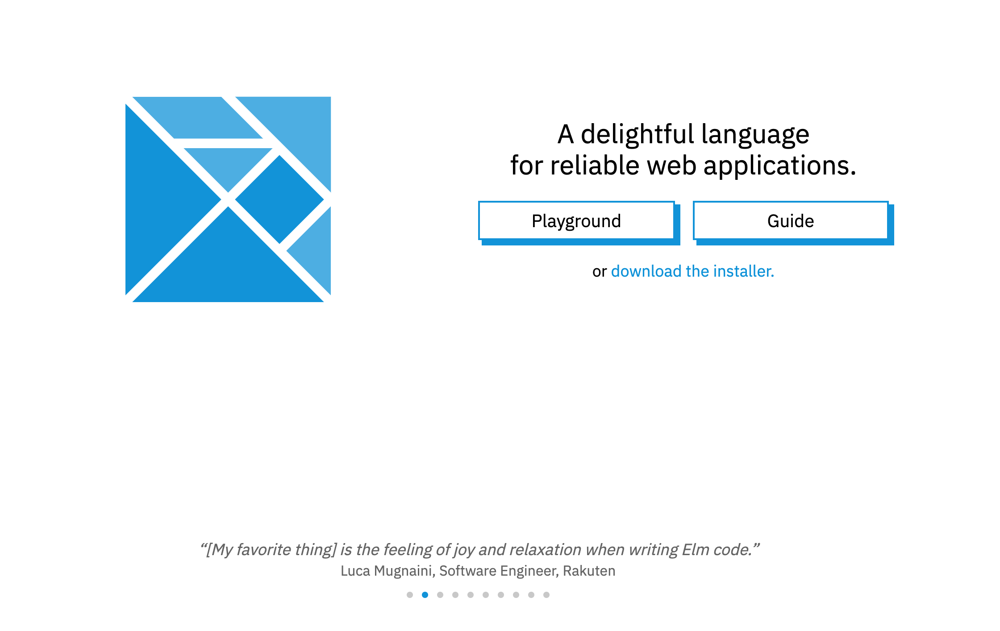

footer: bobkonf 2022 / **@arkh4m**
autoscale: true
build-lists: true
theme: Olive Green, 9

# An Enigma
# Machine
# in Elm



---

# Hello! 🐒

---

# My name is Ju 🙇🏻‍♂️

---

# `whoami`

- I was born in 🇨🇳
- Grew up in 🇮🇹
- Live in 🇬🇧
- Find me at **@arkh4m**
- Work for no\_red\_ink

---

# A super super super short history of cryptography

---

# What is it

_kryptos_ hidden / _graphia_ writing

- Encode: turn _plain_ text into _cypher_ text.
- Decode: turn _cypher_ text into _plain_ text.

---

# Caesar Cipher

Shift each letter by 3.

---

# Caesar Cipher

[.column]

_Encode: shift by 3_

> ET TU BRUTUS

turns into

> HW WX EUXWX

---

# Caesar Cipher

[.column]

_Encode: shift by 3_

> ET TU BRUTUS

turns into

> HW WX EUXWX

[.column]

_Decode: shift by -3_

> HW WX EUXWX

turns into

> ET TU BRUTUS

---

# Monoalphabetic substitution

Decide on a mapping between letters:

> ABCDEFGHIJKLMNOPQRSTUVWXYZ
> ZYXWVUTSRQPONMLKJIHGFEDCBA

---

# Monoalphabetic substitution

[.column]

_Encode_: lookup table

> NEVER GONNA GIVE YOU UP

turns into

> MVEVI TLMMZ TREV BLF FK

---

# Monoalphabetic substitution

[.column]

_Encode_: lookup table

> NEVER GONNA GIVE YOU UP

turns into

> MVEVI TLMMZ TREV BLF FK

[.column]

_Decode_: reverse lookup

> MVEVI TLMMZ TREV BLF FK

turns into

> NEVER GONNA GIVE YOU UP

---

# Any problems?

---

# Spaces

- Spaces in cipher text give away too much.
  `MVEVI TLMMZ TREV BLF FK`
- Easy fix, just remove them!
  `NEVER GONNA GIVE YOU UP`
  turns into
  `MVEVITLMMZTREVBLFFK`

---

# Frequency analysis



---

# No fix sry 🙀🙀🙀

---

# Fast forward a 1000 years...

---

# The Enigma Machine


---

# The Enigma Machine


- Used from the 1920s
- Used by all Wehrmacht in WW2
- Mechanical with a battery
- Polyalphabetic cipher

---

# Polyalphabetic

The cipher changes at every keypress! How?


---



---



---

# Journey of a letter


---


---

# How to use the Enigma Machine

---



---

# How to encipher a message

- Open the codebook
- Pick the rotors with the right settings
- Set the plugboard
- Set the rotor positions randomly (write this down)
- Choose a three letter message key and encode it twice (write it down)
- Set the rotors positions to the message key and encrypt the message
- Send in plaintext the initial random positions, the six letter encoded
  message key and the encrypted message

---



---

# How to decipher a message

- Open the codebook
- Pick the rotors with the right settings
- Set the plugboard
- Set the rotor positions to the three letter plaintext message
- Decode the six letters to get the message key repeated twice
- Set the rotors to the message key and decrypt the message

---

# Elm!

---



---

# Elm

- Statically typed
- Pure
- Fun (hehe)

---

# Code dive 🤿

---

# Rotor: encoding

```elm
encode : Char -> Enigma -> ( Char, Enigma )
encode input enigma =
    let
        ({ leftRotor, middleRotor, rightRotor } as stepped) =
            step enigma
    in
    ( input
        |> Plugboard.swap enigma.plugboard
        |> Rotor.toRotorOffset
        |> Rotor.forward rightRotor
        |> Rotor.forward middleRotor
        |> Rotor.forward leftRotor
        |> Reflector.reflect enigma.reflector
        |> Rotor.backward leftRotor
        |> Rotor.backward middleRotor
        |> Rotor.backward rightRotor
        |> Rotor.fromRotorOffset
        |> Plugboard.swap enigma.plugboard
    , stepped
    )
```

---

# Rotor: stepping

```elm
step : Enigma -> Enigma
step ({ leftRotor, middleRotor, rightRotor } as info) =
    case ( Rotor.atNotch middleRotor , Rotor.atNotch rightRotor) of
        ( True, _ ) ->
            { info
                | middleRotor = Rotor.turn middleRotor
                , leftRotor = Rotor.turn leftRotor
                , rightRotor = Rotor.turn rightRotor
            }

        ( _, True ) ->
            { info
                | middleRotor = Rotor.turn middleRotor
                , rightRotor = Rotor.turn rightRotor
            }

        _ ->
            { info | rightRotor = Rotor.turn rightRotor }
```

---

# Let's try it out!

---


---

- Today is the 11th
- Rotors: V I III
- Settings: 17 13 04
- Plugboard: SV GO PA ZR FN HI YM WT DE BJ
- Random starting position: 5 12 13
- Message key: MIC
- Message: `KEINE BESONDEREN EREIGNISSE`

---

# Resources

- How did the Enigma Machine work?
  [https://www.youtube.com/watch?v=ybkkiGtJmkM](https://www.youtube.com/watch?v=ybkkiGtJmkM)
- Enigma, Historical Lessons in Cryptography
  [https://jgandrews.com/posts/the-enigma-machine](https://jgandrews.com/posts/the-enigma-machine)
- Working principle of the Enigma
  [https://cryptomuseum.com/crypto/enigma/working.htm](https://cryptomuseum.com/crypto/enigma/working.htm)
- A better Elm implementation
  [https://simonhauck.github.io/Enigma-Elm](https://simonhauck.github.io/Enigma-Elm)
- Enigma Machine Emulator
  [https://www.101computing.net/enigma-machine-emulator](https://www.101computing.net/enigma-machine-emulator)
- Cipher Machines and Cryptology
  [https://www.ciphermachinesandcryptology.com](https://www.ciphermachinesandcryptology.com)
- The German cipher machine Enigma
  [https://www.matematiksider.dk/enigma_eng.html](https://www.matematiksider.dk/enigma_eng.html)

---

# Thank you!


- [@arkh4m](https://twitter.com/arkh4m)
- [https://enigma.juliu.is](https://enigma.juliu.is)
- [https://github.com/arkham/enigma-in-elm](https://github.com/arkham/enigma-in-elm)
- [https://donate.unhcr.org/int/en/ukraine-emergency](https://donate.unhcr.org/int/en/ukraine-emergency)


